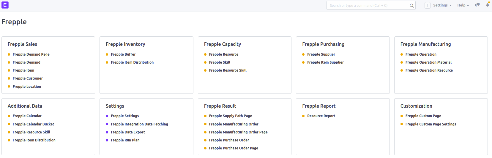
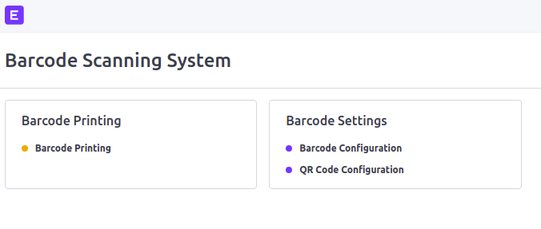

# Integrated Resource Planning System IRPS
<a href="https://github.com/chiajunshen/shrdc_custom_frappe_docker/blob/master/LICENSE">
    
</a>
<a href="https://github.com/chiajunshen/shrdc_custom_frappe_docker/releases">
    
</a>
<a href="https://github.com/chiajunshen/shrdc_custom_frappe_docker/releases">
    
</a>
<a href="https://github.com/chiajunshen/shrdc_custom_frappe_docker/issues">
      
</a>
<a href="https://github.com/chiajunshen/shrdc_custom_frappe_docker/pulls">
    
</a>

<br>


<br>


<br>


<br>

## For ERPNext User

### 1. List of possible ERPNext docker setup
- Production Setup: Single Server Single Bench (follow the guide below)
- [Production Setup: Single Server Multi Bench](https://github.com/chiajunshen/shrdc_frappe_docker/blob/main/docs/multi-bench.md)
- [Production Setup: Multi Server Docker Swarm](https://github.com/chiajunshen/shrdc_frappe_docker/blob/main/docs/docker-swarm.md)
- [Production Setup: Multi Server Kubernetes](https://helm.erpnext.com/)
- [Development Setup: Source code access with VSCode](https://github.com/chiajunshen/shrdc_frappe_docker/tree/main/development)

### 2. Integrated Resource Planning System IRPS
1. Prerequisites:
    - Windows: Docker Desktop
    - Ubuntu: Docker Engine, Docker Compose
    - Mac: Docker Desktop

2. Frappe Apps included:
    - [ERPNext Version 12](https://github.com/frappe/erpnext)
    - [Metabase Integration](https://github.com/chiajunshen/shrdc_frappe_metabase)
    - [Telegram Integration](https://github.com/chiajunshen/shrdc_erpnext_telegram)
    - [Frepple Integration](https://github.com/Drayang/ERPNext-Frepple)
    - [Barcode Scanning System](https://github.com/leexy0/barcode_shrdc)

3. For Windows & MacOS user, start from `Section 3`.
4. For Ubuntu user, start from `Section 4`.

### 3. Pre-Setup: Windows/MacOS
1. The setup guide is tested to work on `Windows 10`, `Ubuntu 18.04` and `macOS Mojave 10.14.6`

2. For Windows and MacOS, create a folder.

3. Open a Powershell terminal, navigate to the newly created folder.

4. Go to `Section 5`.

### 4. Pre-Setup: Ubuntu
1. Open a terminal.

2. Create a user called `frappe`. (You can give a name of your preference to replace `frappe`)
    - `sudo adduser frappe`

3. You may be promted to give a password for the newly created user `frappe`. Remember this password, you will need it for the next step.

4. Log into the user `frappe`
    - `su - frappe`

5. Create a folder called `frappe_docker`. Again, folder name is of your preference. Navigate into the new directory.
    - `mkdir frappe_docker`
    - `cd frappe_docker`

6. Go to `Section 5`.

### 5. Setup

1. Clone this repo.
    - `git clone https://github.com/msf4-0/Integrated-Resource-Planning-System-IRPS.git`

2. Navigate to the cloned folder.
    - `cd Integrated-Resource-Planning-System-IRPS`

3. In `enx-example`, you can change the `ERPNEXT_SERVER_PORT` and `MARIADB_SERVER_PORT` variables. Copy environment variables from the `env-example` file into `.env` file.
    - Upon successful setup, you can access ERPNext via port number `ERPNEXT_SERVER_PORT`
    - For Metabase Integration, you would need to connect to Mariadb via `MARIADB_SERVER_PORT`
    - `cp env-example .env`

4. Start all the docker containers. Note: Replace `<project_name>` to your preference.
    - `docker-compose -p <project_name> up -d`
    - For example, `docker-compose -p project1 up -d`

5. Monitor the site creation progress by logging the `<project_name>_site-creator_1` container.
    - `docker logs <project_name>_site-creator_1 -f`
    - For example, `docker logs project1_site-creator_1 -f`
    - If you face `no such container` error, try with `docker logs project1-site-creator-1 -f`

6. After the `<project_name>_site-creator_1` container display `Scheduler is disabled`, you can open `Google Chrome` and access ERPNext via `localhost:8000` or `127.0.0.1:8000`.

### 6. Stopping Docker Containers
1. To stop all the docker containers related to your `<peoject-name`> project
    - In the `Integrated-Resource-Planning-System-IRPS` directory, run `docker-compose -p <project-name> stop`
    - For example, `docker-compose -p project1 stop`

### 7. Starting Docker Containers
1. To start up all the docker containers related to your `<peoject-name`> project
    - In the `Integrated-Resource-Planning-System-IRPS` directory, run `docker-compose -p <project-name> start`
    - For example, `docker-compose -p project1 start`

### 8. Deleting Docker Containers
1. To remove all the docker containers related to your `<peoject-name`> project
    - Run `docker-compose -p <project-name> down`
    - Run `docker-compose -p <project-name> down -v` to remove the related Docker Volume
    - For example, `docker-compose -p project1 down -v`

## Update Custom App
1. Assumptions:
    1. You have a running instance of ERPNext in docker production container.
2. [How to update custom app](https://docs.google.com/document/d/1XCfNE1SoWK3MvIFHlthTw0GBUqfyAD66YM2hoO62CjU/edit?usp=sharing)

## Backup
1. Assumptions:
    1. You have a running instance of ERPNext in docker production container.
2. Alternatives:
    1. [Online Backup (Automatic)](https://docs.google.com/document/d/1nFbnYwB1hkFBeqMrb35IOHjo7M4PF9sRGHR08TtVJ6w/edit?usp=sharing)
    2. [Local Backup (Manual)](https://docs.google.com/document/d/1x_-71FcPrrhF7vvuBX37G0No-TlPxyTQNcQWuN0f8cE/edit?usp=sharing)
    3. [Local Backup (Automatic)](https://docs.google.com/document/d/1Is8J244t_-t4Ue4bbgPr0Y4P20-0wFKE5IkGEPYU-cE/edit?usp=sharing)

## Restore
1. Assumptions:
    1. You have your backup files on your pc (if you perform online backup, you can download the backup files onto your pc).
    2. You have a running instance of ERPNext in docker production container in which you want to restore with the backup files.
2. [Restore](https://docs.google.com/document/d/1yG2N1isESsdtDdfH3aHykIrgD6lnVOLzK0zThKLreHA/edit?usp=sharing)

## For Developer
- [Reference: Customizing your own shrdc custom frappe docker](https://docs.google.com/document/d/1XxOYM_qhZ0RGI60YM82XHOkEzrn8ywXC98i354Donjc/edit)

### 1. Introduction

- Fork this repo to build your own image with ERPNext and list of custom Frappe apps.
- Change `nginx/Dockerfile` and add required apps. Refer comments in the file.
- Change `worker/Dockerfile` and add required apps.

Example file uses following apps:

- [Metabase Integration](https://github.com/chiajunshen/shrdc_frappe_metabase)
- [Telegram Integration](https://github.com/chiajunshen/shrdc_erpnext_telegram)
- [Frepple Integration](https://github.com/Drayang/ERPNext-Frepple)
- [Barcode Scanning System](https://github.com/leexy0/barcode_shrdc)

### 2. Build images

Execute from root of app repo.

For nginx:

```shell
# For version-12
docker build --build-arg=FRAPPE_BRANCH=version-12 --build-arg=GITHUB_OWNER=<github-username> -t custom-erpnext-nginx:v12 nginx

# Example:
docker build --build-arg=FRAPPE_BRANCH=version-12 --build-arg=GITHUB_OWNER=msf4-0 -t custom-erpnext-nginx:version-12 nginx
```

For worker:

```shell
# For version-12
docker build --build-arg=FRAPPE_BRANCH=version-12 --build-arg=GITHUB_OWNER=<github-username> -t custom-erpnext-worker:version-12 worker

# Example:
docker build --build-arg=FRAPPE_BRANCH=version-12 --build-arg=GITHUB_OWNER=msf4-0 -t custom-erpnext-worker:version-12 worker
```

### 3. Push images to Docker Hub
1. [Steps to create a Docker Hub, and push images to it.](https://docs.docker.com/get-started/04_sharing_app/)
2. Possible troubleshoot:
    1. When you face `denied: requested access to the resource is denied` when pushing images, run `docker login` and enter your credentials. Then push image again.

### 4. (Optional) Configure `env-example`
1. You may need to change the `DOCKER_USERNAME` in `env-example` to the username of the Docker Hub account in which you have pushed your images to.
2. Copy `env-example` into `.env` by running `cp env-example .env`.

### 5. Start up
1. The following commands should be executed on the `~/some/path/shrdc_custom_frappe_docker` directory
2. `docker-compose -p <project_name> up -d`
3. `docker logs <project_name>_site-creator_1 -f`
    1. If you got a `no such container` error, you may need to change to `docker logs <project_name>-site-creator-1 -f`
4. After the `site_creator` container exited, open a browser, you can access ERPNext on `localhost:8000` or `127.0.0.1:8000`.
5. You can push the changes back to this repo (or your own repo if you forked one from this repo).

## Contributors
1. [Drayang Chua Kai Yang](https://github.com/Drayang)
2. [Lee Xin Yue](https://github.com/leexy0)
3. [Chia Jun Shen](https://github.com/chiajunshen)
